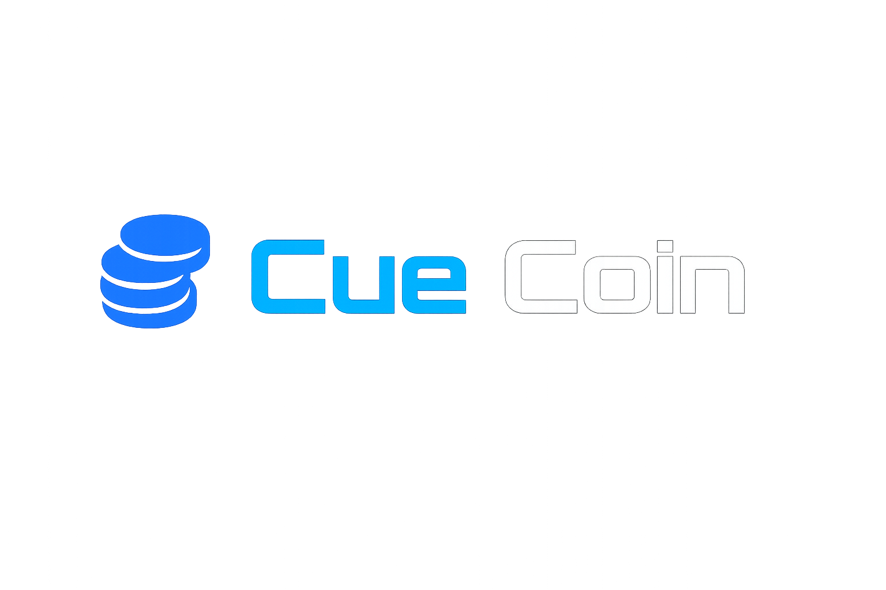

#  CueCoin Ecosystem

CueCoin (CUE) is the **native BEP-20 token** of the CueCoin skill-based gaming ecosystem on the **BNB Smart Chain**. It powers **skill gaming, NFT trading, P2E rewards, tournaments, and governance**. The ecosystem is fully self-sustaining, with automatic liquidity, deflationary mechanics, and timelocked pool and oracle updates for maximum security.

---

## Ecosystem Flow Diagram

`graph LR
    %% Core Token & Pools
    CUE["CueCoin (CUE)"] --> LP["Auto-LP Engine"]
    CUE --> P2E["CueRewardsPool (P2E Rewards + NFT Bonuses)"]
    CUE --> TOURN["CueTournament (Prize Pool)"]
    CUE --> DAO["CueDAO Treasury (Governance)"]
    CUE --> DEV["Dev Multisig (Operations, Payroll, Marketing)"]
    CUE --> BURN["Burn (0xdead)"]

    %% NFT & Marketplace
    CUE --> NFT["CueNFT (NFT Mint & Rewards)"]
    NFT --> MARKET["CueMarketplace (NFT Trading)"]

    %% Gaming & Skills
    CUE --> SNG["CueSitAndGo (Skill Gaming Tournaments)"]
    CUE --> TASK["CueTaskRegistry (Skill Tasks)"]

    %% Referral & Incentives
    CUE --> REF["CueReferral (Referral Rewards)"]

    %% Escrow & Vesting
    CUE --> ESC["CueEscrow (Locked Payments)"]
    CUE --> VEST["CueVesting (Team / Investor Vesting)"]

    %% Bridge & Airdrop
    CUE --> BRIDGE["CueBridge (Cross-Chain Transfers)"]
    CUE --> AIRDROP["CueAirdrop (Token Distribution)"]

    %% Flows / interactions
    LP --> BURN
    LP --> MARKET
    P2E --> SNG
    TOURN --> SNG
    REF --> SNG
    VEST --> DEV
    ESC --> DEV

Deployment Setup

Install dependencies:

npm install

Configure hardhat.config.js or truffle-config.js with BSC mainnet/testnet RPC.

Deploy CueCoin first:

npx hardhat run scripts/deployCueCoin.js --network bscTestnet

Deploy all pools & ecosystem contracts (replace addresses with CueCoin address):

npx hardhat run scripts/deployEcosystem.js --network bscTestnet

Configure oracles, timelocks, and trading:

Set priceOracle & lpOracle

Enable trading: cueCoin.enableTrading()

Queue pool & oracle updates via timelock

 Features

Automatic liquidity provision & burn mechanism

Play-to-Earn reward system with NFT bonuses

Skill-based gaming tournaments

Referral incentives for players

Vesting & escrow for team & investors

DAO governance with ERC20Votes integration

Velocity Shield & Whale Guard for anti-dump protection

Cross-chain bridge & airdrop system for distribution

 License

This project is licensed under the MIT License — see the LICENSE
 file for details.
